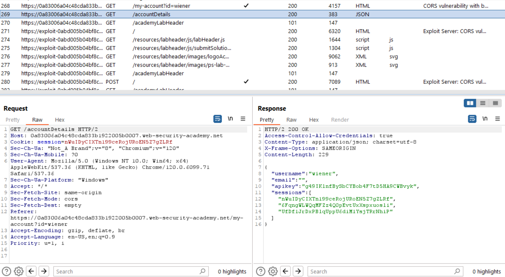
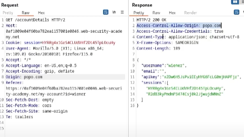

# Writeup

## 1. Phân tích trang web:
- Mở burpsuite, sau khi login check lịch sử HTTP -> `accountDetails` :

-> Trả về 1 cái JSON, có `session` tương ứng với `apikey`

- Vuln: Mỗi lần login sẽ có 1 cái session riêng (cookie), nhưng nếu dùng đúng cái cookie cũ thì vẫn login được (thử với `cookie editor`) -> apikey giữ nguyên nhưng session thay đổi với mỗi lần login -> dùng session của admin sẽ có được apikey của admin

- Solve: 
    + dùng `XMLHttpRequest`
    + tấn công vào `/accountDetails`
    + viết script
    + href 1 trang web để đọc cái key (VD: "/exomuk?key=abcd")