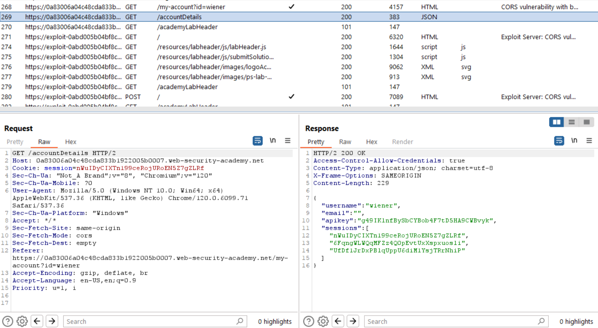
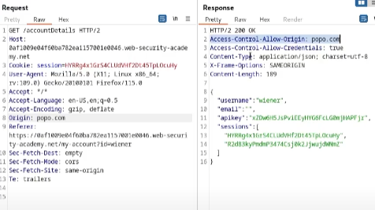
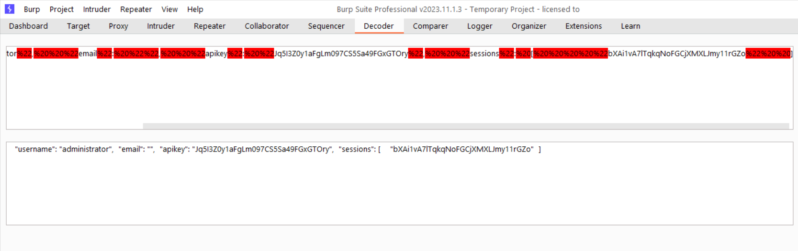

# Writeup

## 1. Phân tích trang web:
- Mở burpsuite, sau khi login check lịch sử HTTP -> `accountDetails` :

-> Trả về 1 cái JSON, có `session` tương ứng với `apikey`

- Mỗi lần login sẽ có 1 cái session riêng (cookie), nhưng nếu dùng đúng cái cookie cũ thì vẫn login được (thử với `cookie editor`) -> apikey giữ nguyên nhưng session thay đổi với mỗi lần login -> dùng session của admin sẽ có được apikey của admin
- Origin là gì cũng được -> vuln

## 2. Solve: 
- dùng `XMLHttpRequest`
- tấn công vào `/accountDetails`
- viết script
- href 1 trang web để đọc cái key (VD: "/exomuk?key=abcd") với key là JSON của mình
- Mở exploit server để check log sau khi gửi script cho user -> Thu được thông tin của admin
- Decode trong burp thu được apikey của admin 🚩

(Tham khảo: "https://portswigger.net/web-security/learning-paths/cors/cors-vulnerabilities-arising-from-cors-configuration-issues/cors/server-generated-acao-header-from-client-specified-origin-header")