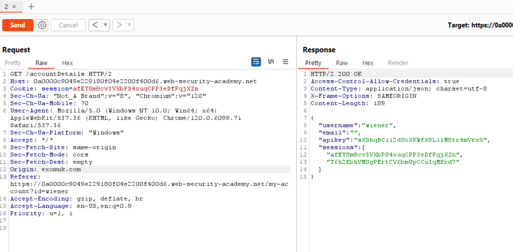
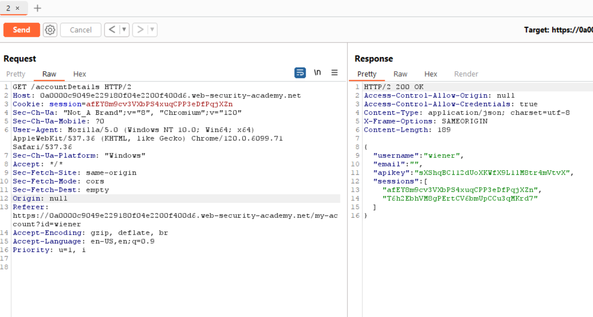
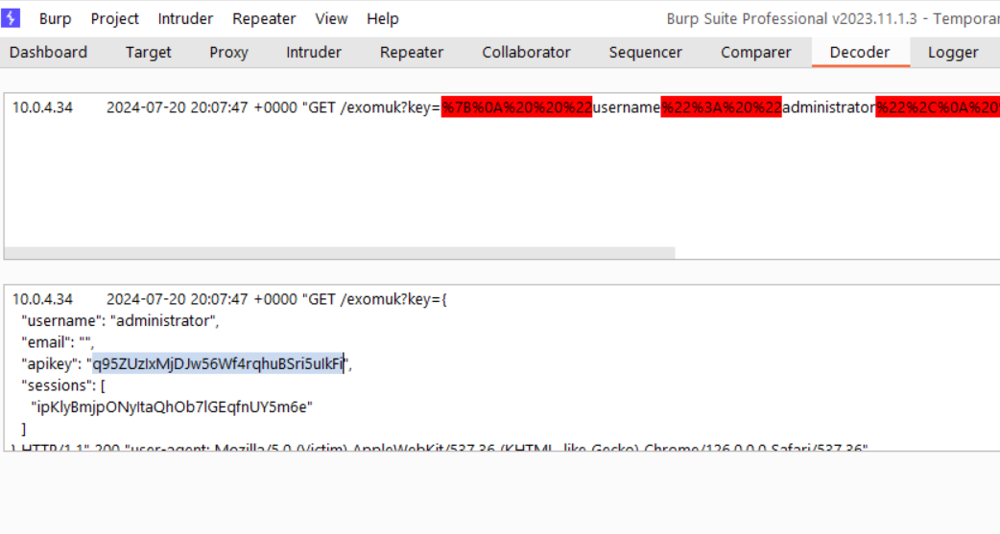

# Writeup

## 1. Phân tích trang web:
- Tương tự như bài trước, nhưng `Origin` là `null` thay vì là gì cũng được như bài trước

- Nếu thay `null` vào `Origin` thì được như sau

## 2. Solve: 
- Thay vì viết thẳng 1 script thì giấu vào trong 1 cái form, trong 1 cái `<iframe>` rồi gửi cho victim rồi nhận lại thông tin 🚩
- Sử dụng `allow-forms` vì code malicious được gửi qua 1 cái form
- Sử dụng `allow-scripts` vì mình chèn code vào cái iframe
- Sử dụng `allow-top-navigation` vì mình sẽ muốn đổi hướng khi load cái web sang `/exomuk?key=...`
- Encode JS sang dạng HTML rồi vứt vào srcdoc rồi đóng vai hắc cơ thôi

